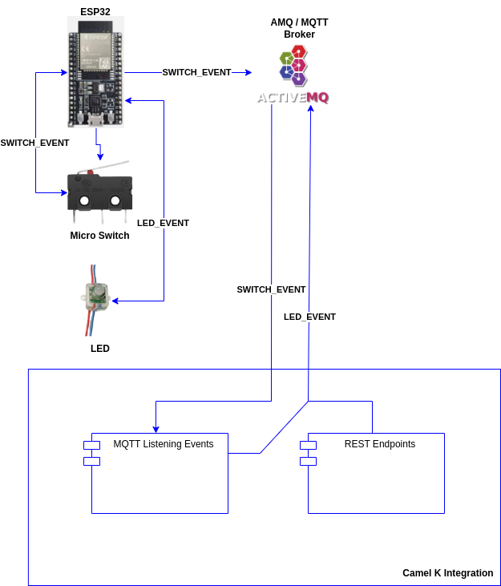

# Smart Galley Cart

The intent of this project is to explore the use of no code techniques in IOT applications.

I have selected devices that can communicate via MQTT / REST and then use Camel Routes to orchestrate events.  And while Camel has been traditionally been home for Java developers, there is a subproject of Camel called Karavan (https://camel.apache.org/categories/Karavan/) which intends to be a visual desginer for integrations.  When leveraging Karavan, the output is Camel yaml file that can be executed in a kubernetes based cluster or simply on the command via JBang.

While the overall poject has a number of other non-software components, for purposes of this documentation, lets focus on the Camel Integration. Here is a simple digram outlining the overall intent of the Camel Routes.

This repository contains all the code for the Camel K Integration.  It presents a Camel Route that listens to MQTT events, as well
as 3 Camel Routes that host 3 REST services that can modify the behavior of the Lights / Sign on the Galley Cart.  These changes
are communicated via MQTT.

These MQTT events are sent / received via an ActiveMQ broker to ESP32 devices that can control various lighting effects.

## Design Approach

With the intent to build out an integration with "no code", this efforts started with designing a specification in Apicurio Studio
(https://studio.apicur.io/) which allows for design-first REST API development. The specification was then published to this
git repository so that it could be ingested by the Camel Karavan project.

Using the Camel Karavan plugin for Visual Studio (https://marketplace.visualstudio.com/items?itemName=camel-karavan.karavan), a
new integration is created (yaml) from the Open Api created from Apicurio. This seeds the project with 3 empty Camel routes that
intend to implement the defined REST APIs.

In addition to these Camel routes, an additional Camel route is created to listen to MQTT events coming from the ESP32 devices.

Upon crafting the integration via the Camel Karavan designer, there is a resulting Camel K yaml file which is then ready to be
deployed in a kubernetes / OpenShift cluster. For testing or executing on smaller devices, you can also run the integration
via Camel JBang (https://camel.apache.org/manual/camel-jbang.html) which allows for easy running of Camel routes by bundling
them into a Quarkus runtime.

To execute the integration, the following command is run from the command line:

`jbang -Dcamel.jbang.version=3.18.3 camel@apache/camel run smart-galley-cart-v1.yaml`

## Testing

In the test-data directory, there is a number of json payloads that can be used to change the light / sign patterns.

`curl -d "@sign.json" -H "Content-Type: application/json" -X POST http://{IP_ADDRESS}:8080/cart/sign`

`curl -d "@lights.json" -H "Content-Type: application/json" -X POST http://{IP_ADDRESS}:8080/cart/lights`

`curl -d "@sign-off.json" -H "Content-Type: application/json" -X POST http://{IP_ADDRESS}:8080/cart/sign`

`curl -d "@lights-off.json" -H "Content-Type: application/json" -X POST http://{IP_ADDRESS}:8080/cart/lights`
